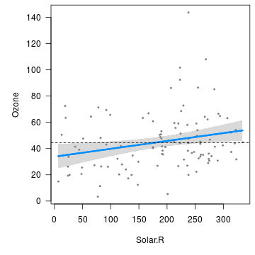
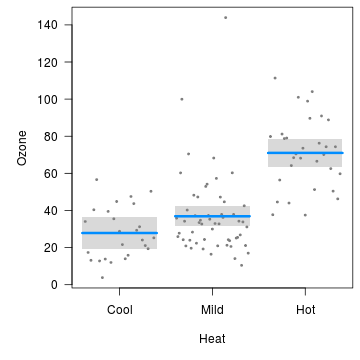

---
---


Let's begin with a simple, additive, linear model:


```r
fit <- lm(Ozone ~ Solar.R + Wind + Temp, data=airquality)
summary(fit)$coef
```

```
##                 Estimate  Std. Error   t value     Pr(>|t|)
## (Intercept) -64.34207893 23.05472435 -2.790841 6.226638e-03
## Solar.R       0.05982059  0.02318647  2.579979 1.123664e-02
## Wind         -3.33359131  0.65440710 -5.094063 1.515934e-06
## Temp          1.65209291  0.25352979  6.516366 2.423506e-09
```

As the summary indicates, wind and temperature have clear effects on ozone, whereas solar radiation has a more subtle effect.  Visual summaries are often more informative and clear than numerical summaries.  Let's see what `visreg` provides:


```r
visreg(fit, "Wind")
```


```r
visreg(fit, "Solar.R")
```



The visual summaries reinforce the numeric ones: Wind has an undeniable negative association with ozone, whereas the effect of solar radiation is just barely significant: you can try adding `abline(h=44.5, lty=2)` to the above plot to see that the gray band just barely excludes a flat line.

All aspects of the above plot (the line, the partial residuals, the band) depend on the specification of not only `Solar.R` but also of all the other terms in the model.  In other words, the result is fully conditional on all components of the predictor; in `visreg`, this type of plot is called a *conditional* plot, and it is the default type.  By default, the other terms in the model are set to their median if the term is numeric or the most common category if the term is a factor.  Changing these defaults is disucssed in [conditioning](conditioning.html).

In addition to continuous explanatory variables, `visreg` also allows the easy visualization of differences between the levels of categorical variables.  The following block of code creates a factor called `Heat` by discretizing `Temp`, and then visualizes its relationship with `Ozone`:


```r
airquality$Heat <- cut(airquality$Temp, 3, labels=c("Cool", "Mild", "Hot"))
fit <- lm(Ozone ~ Solar.R + Wind + Heat, data=airquality)
visreg(fit, "Heat")
```


