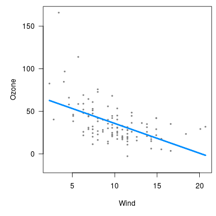
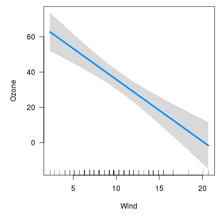
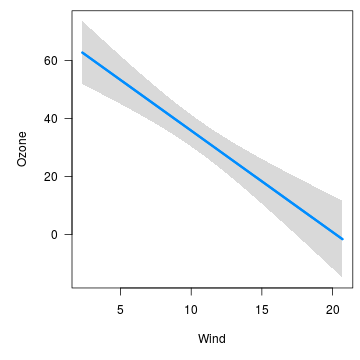
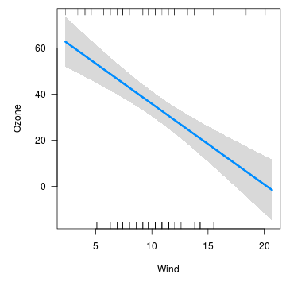
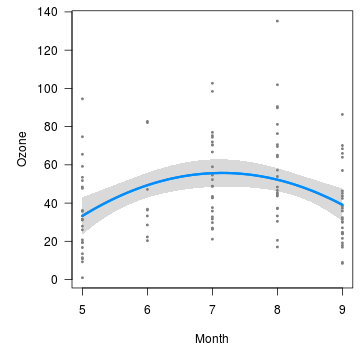
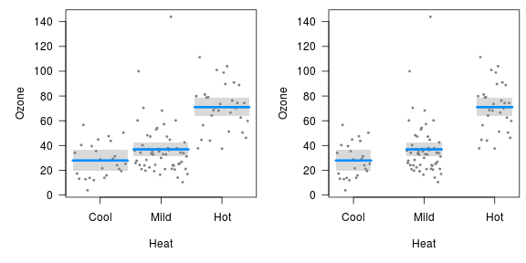

---
---


`visreg` tries to set up pleasant-looking default options, but everything can be tailored to user specifications.  For the plots below, we work from this general model:


```r
airquality$Heat <- cut(airquality$Temp, 3, labels=c("Cool", "Mild", "Hot"))
fit <- lm(Ozone ~ Solar.R + Wind + Heat, data=airquality)
```

# Turning on/off plot components

By default, `visreg` includes the fitted line, confidence bands, and partial residuals, but the residuals and the bands can be turned off:


```r
visreg(fit, "Wind", band=FALSE)
```




```r
visreg(fit, "Wind", partial=FALSE)
```



Note that by default, when you turn off partial residuals, visreg tries to display a rug so you can at least see where the observations are.  You can turn this off too:


```r
visreg(fit, "Wind", partial=FALSE, rug=FALSE)
```



Finally, there is an option for displaying separate rugs for positive and negative residuals on the top and bottom axes, respectively, with `rug=2` (this is particularly useful for [logistic regression](glm.html)):


```r
visreg(fit, "Wind", rug=2, partial=FALSE)
```



# Jittering

If there are many ties in a numeric variable `x`, jittering can be helpful way to avoid overplotting:


```r
fit <- lm(Ozone ~ Solar.R + Wind + poly(Month, 2), data=airquality)
visreg(fit, "Month")
```




```r
visreg(fit, "Month", jitter=TRUE)
```


# Appearance of points, lines, and bands

Specifying `col='red'` won't work, because `visreg` can't know whether you're trying to change the color of the line, the band, or the points.  These options must be specified through separate parameters lists:

* `line.par`: Controls the appearance of the fitted line
* `fill.par`: Controls the appearance of the confidence band
* `points.par`: Controls the appearance of the partial residuals

Each of these can be abbreviated, as in the example below:


```r
visreg(fit, "Wind", line=list(col="red"),
                    fill=list(col="green"),
                    points=list(cex=1.5, pch=1))
```


# Generic plot options

Other options get passed along to `plot`, so any option that you could normally pass to `plot`, like `main`, will work fine.  Here's an example that includes a bunch of options like this:


```r
fit <- lm(log(Ozone) ~ Solar.R + Wind + Temp, data=airquality)
visreg(fit, "Wind", yaxt="n", main="Ozone is bad for you", bty="n", ylab="Ozone")
at <- seq(1.5, 5, 0.5)
lab <- round(exp(at), 1)
axis(2, at=at, lab=lab, las=1)
```


# Whitespace for factors

When `x` is a factor, the `whitespace` option controls the amount of whitespace in between the categories:


```r
fit <- lm(Ozone ~ Solar.R + Wind + Heat, data=airquality)
par(mfrow=c(1,2))
visreg(fit, "Heat", whitespace=.1)
visreg(fit, "Heat", whitespace=.5)
```


