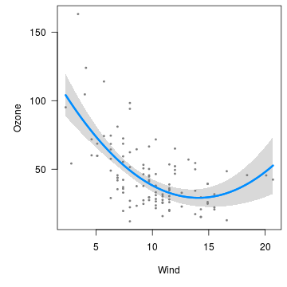
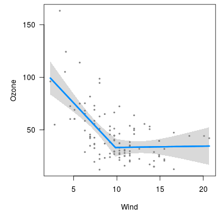
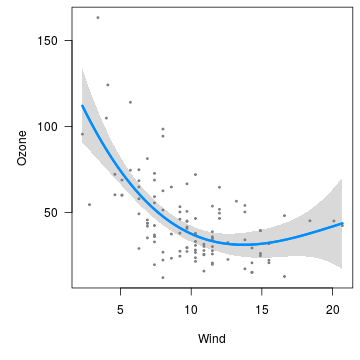
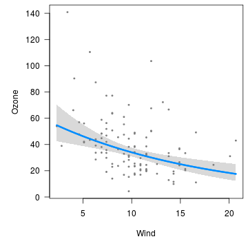
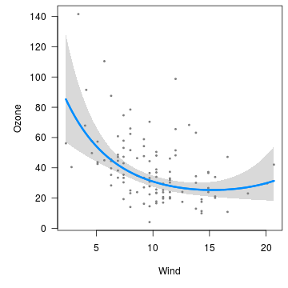

---
---


[Getting started](basic) described how `visreg` provides a visual summary of a model, somewhat akin to the numerical summary you get from `summary(fit)`.  For nonlinear terms, however, it is usually difficult to interpret numerical summaries, and visual representations become far more important.

# Nonlinear terms

For example, suppose we allow the effect of wind on ozone to be nonlinear by introducing a quadratic term into the model:


```r
fit <- lm(Ozone ~ Solar.R + Wind + I(Wind^2) + Temp, data=airquality)
visreg(fit, "Wind")
```



Note that `visreg` automatically detects the nonlinear relationship and represents this correctly in the plot.  This should work for any transformation you can think of; here are some examples:


```r
fit <- lm(Ozone ~ Solar.R + Wind + Wind*I(Wind > 10) + Temp, data=airquality)
visreg(fit, "Wind", print.cond=FALSE)
```




```r
fit <- lm(Ozone ~ Solar.R + poly(Wind, 3) + Temp, data=airquality)
visreg(fit, "Wind")
```




```r
library(splines)
fit <- lm(Ozone ~ Solar.R + ns(Wind, df=3) + Temp, data=airquality)
visreg(fit, "Wind")
```


If you ever run across a kind of transformation that produces an error in `visreg`, [please tell us about it](https://github.com/pbreheny/visreg/issues) and we will fix it ASAP.

# Transformations of the outcome

Another kind of nonlinear model arises when the outcome is transformed, but we are interested in plotting the relationship on the original scale.  For example, ozone levels must be positive.  However, the <a href="index.html#gam">GAM on the front page</a> illustrates, some models may result in predictions or confidence band that fall below 0.  One way of remedying this is to model the log of ozone concentrations instead of the ozone concentrations directly:


```r
fit <- lm(log(Ozone) ~ Solar.R + Wind + Temp, data=airquality)
visreg(fit, "Wind", trans=exp, ylab="Ozone", partial=TRUE)
```



Note that here, the plotting involves an inverse transformation.  There is no automatic way for `visreg` to know what the correct inverse transformation is (except for [GLMs](glm.html)), so this must be supplied as a function.

Also note that by default, `visreg` turns off partial residuals when `trans` is specified, as this can provide a distorted view of outliers (a mild outlier can become an extreme outlier once a transformation has been applied, and vice versa), but we include them here by explicitly specifying `partial=TRUE`.  This is discussed in greater depth in the page on [GLMs](glm.html#scale).

# Combining nonlinear terms with transformations

As one would hope, nonlinear terms and outcome transformations can be combined and visualized in a straightforward manner:


```r
fit <- lm(log(Ozone) ~ Solar.R + Wind + I(Wind^2) + Temp, data=airquality)
visreg(fit, "Wind", trans=exp, ylab="Ozone", partial=TRUE)
```



